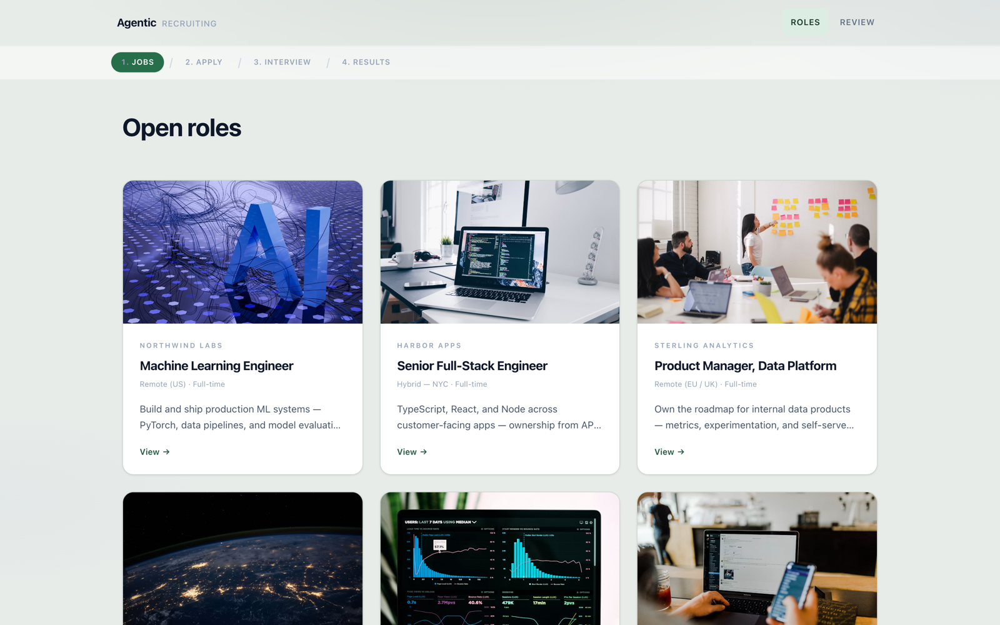
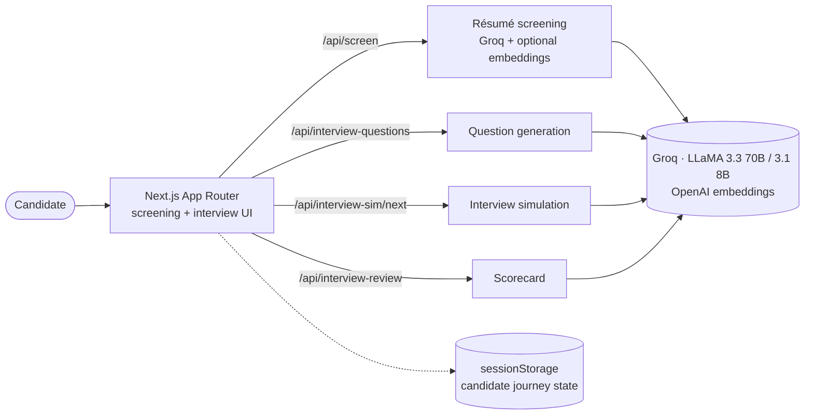

<div align="center">

# 🧑‍💼 Agentic Recruiting Platform

### An end-to-end AI hiring flow — screen a résumé, generate tailored interview questions, run a simulated interview with voice, and produce a scored candidate report. Built on Next.js and deployed to Cloudflare Workers.

[](https://agentic-recruiting.dishasawantt.workers.dev)
[](https://nextjs.org)
[](https://groq.com)
[](https://www.typescriptlang.org)
[](https://workers.cloudflare.com)

**[Features](#-features) · [Architecture](#-architecture) · [Tech Stack](#-tech-stack) · [Getting Started](#-getting-started) · [Candidate Journey](#-candidate-journey)**

</div>

<p align="center">
  <a href="https://agentic-recruiting.dishasawantt.workers.dev">
    
  </a>
</p>

---

## Overview

Recruiting teams lose hours to the same repetitive loop: read a résumé, decide if it fits, write interview questions, run the interview, and turn it all into a consistent scorecard. **Agentic Recruiting** compresses that loop into a single guided flow — the candidate applies, and AI handles screening, question generation, a turn-by-turn interview (with **voice**), and a final scored review — while keeping the recruiter in the loop for the decision.

It runs as a **Next.js App Router** app with API routes deployed to **Cloudflare Workers** via OpenNext, using **Groq** for fast LLM inference and optional **OpenAI embeddings** for résumé-to-role similarity.

> **Try it live:** [agentic-recruiting.dishasawantt.workers.dev](https://agentic-recruiting.dishasawantt.workers.dev) — pick a role, paste a résumé, and walk the full JOBS → APPLY → INTERVIEW → RESULTS flow.

## ✨ Features

- 📄 **AI résumé screening** — PDF/DOCX extraction, Groq LLM scoring against the job description, with optional OpenAI embedding similarity.
- 🎯 **Tailored interview questions** generated from the job + candidate profile.
- 💬 **Turn-by-turn interview simulation** with per-dimension scoring.
- 🎙️ **Voice Q&A** via the Web Speech API.
- 🧾 **Automated scorecards** with visual gauges from the interview transcript.
- 📊 **Recruiter ranking dashboard** to compare candidates side by side.

## 🏗️ Architecture



| Route | Purpose |
|---|---|
| `/api/screen` | Résumé screening against the job description |
| `/api/interview-questions` | Generate tailored interview questions |
| `/api/interview-sim/next` | Turn-by-turn interview simulation |
| `/api/interview-review` | Scorecard from the voice Q&A export |
| `/api/health` | Health check |

## 🧰 Tech Stack

| Layer | Technologies |
|---|---|
| **Frontend** | Next.js 14, React 18, Tailwind CSS, TypeScript |
| **AI** | Groq (LLaMA 3.3 70B, LLaMA 3.1 8B), OpenAI embeddings |
| **Parsing** | Mammoth (DOCX), pdf-parse (PDF), Zod validation |
| **Deployment** | Cloudflare Workers via OpenNext |

## 🚀 Getting Started

### Prerequisites

- Node.js 20+
- **Groq API key** (required)
- **OpenAI API key** (optional — enables embedding similarity)

### Installation

```bash
git clone https://github.com/dishasawantt/agentic-recruiting.git
cd agentic-recruiting
npm install
cp .env.example .env.local
```

Edit `.env.local`:

```ini
GROQ_API_KEY=your_groq_key
OPENAI_API_KEY=your_openai_key   # optional
```

### Run locally

```bash
npm run dev
```

Open **http://localhost:3000**

### Deploy to Cloudflare

```bash
npm run deploy
```

Set `GROQ_API_KEY` (and optionally `OPENAI_API_KEY`) in the Cloudflare Workers environment.

## 🧭 Candidate Journey

1. Browse open roles → **Apply**
2. Upload / paste résumé → **AI screening** with a match score
3. Review **generated interview questions**
4. Complete the **text interview simulation**
5. Answer **voice Q&A** (browser speech)
6. Receive the **interview review scorecard**

## 📁 Project Structure

```
src/
├── app/          # Pages and API routes
├── components/   # React UI (screening flow, score visualization)
└── lib/          # Screening, interview, and AI-client logic
```

## 🔐 Security & Privacy

- API keys are read from **environment variables only**.
- Résumé text is processed **server-side**; there is **no persistent database**.
- The demo uses mock job listings and `sessionStorage` for candidate-journey state.

---

<div align="center">

### Disha Sawant
**AI Application Engineer** · M.S. Computer Engineering @ SDSU

[](https://dishasawantt.github.io/resume)
[](https://linkedin.com/in/disha-sawant-7877b21b6)
[](https://github.com/dishasawantt)
[](mailto:dishasawantt@gmail.com)

</div>
